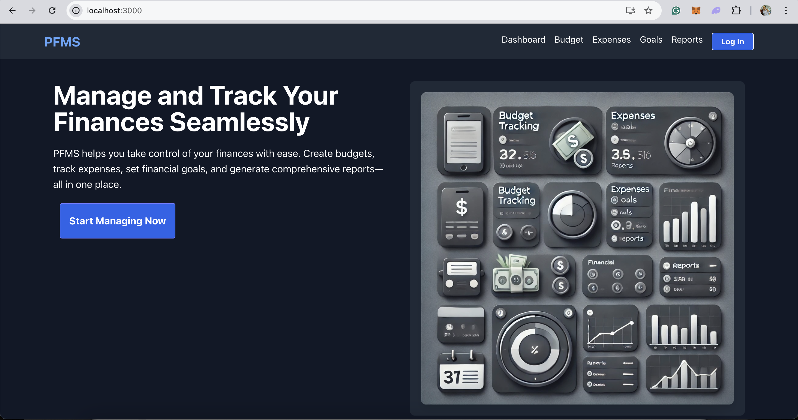
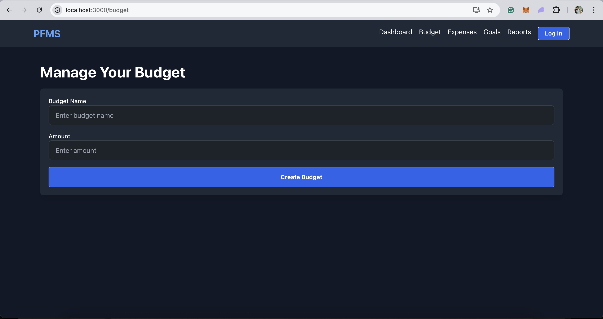
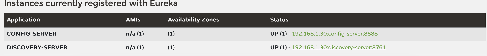

# Personal Finance Management System (PFMS)

## Overview

The **Personal Finance Management System (PFMS)** is a comprehensive application designed to help users manage their finances efficiently. The system is built using a microservices architecture, ensuring scalability, modularity, and resilience. The front-end is developed using React, providing a dynamic and responsive user interface.

## Features

### 1. Microservices Architecture

PFMS is composed of multiple microservices, each responsible for a specific domain of the application:

- **API Gateway (`api-gateway`)**
  - Central entry point for all client requests.
  - Handles routing, load balancing, authentication, and authorization.
  
- **Service Discovery (`discovery-server`)**
  - Manages service registration and discovery using Eureka.
  - Enables dynamic scaling and load balancing.
  
- **Configuration Server (`config-server`)**
  - Centralized configuration management.
  - Allows dynamic reconfiguration of services without needing to restart them.
  
- **User Service (`user-service`)**
  - Manages user registration, authentication, and profiles.
  
- **Budget Service (`budget-service`)**
  - Manages user budgets, including creation, tracking, and updates.
  
- **Expense Service (`expense-service`)**
  - Tracks and manages user expenses, integrates with the Budget Service to update budget status.
  
- **Goal Service (`goal-service`)**
  - Allows users to set and track financial goals, integrating with Budget and Expense Services.
  
- **Notification Service (`notification-service`)**
  - Sends notifications related to budgets, goals, and expenses via email or in-app alerts.
  
- **Reporting Service (`reporting-service`)**
  - Generates financial reports and analytics based on user data.
  
- **Messaging Service (`message-broker`)**
  - Handles asynchronous communication between services using message brokers like Kafka or RabbitMQ.

### 2. Front-End: React UI

The front-end of PFMS is developed using React, providing a modern, dynamic, and responsive user interface:

- **User Dashboard**
  - Overview of the user's financial status, including budgets, expenses, and goals.
  
- **Budget Management**
  - Allows users to create, update, and track budgets.
  
- **Expense Tracking**
  - Interface for logging and categorizing expenses, with visualizations to track spending.
  
- **Goal Setting**
  - Interface for setting financial goals and tracking progress over time.
  
- **Notifications**
  - Users receive real-time notifications about their financial activities, such as budget limits and goal progress.
  
- **Financial Reports**
  - Users can generate and view detailed reports on their financial activities, including spending patterns and goal achievements.

#### 2.1. Screens preview

##### 2.1.1 Screenshots (pfms-ui 1.0.0)




### 3. Deployment

#### 3.1. Backend Services (Microservices)

The microservices are containerized using Docker and can be managed with Docker Compose. Each service is built using Spring Boot and can be deployed independently or together.

##### Running the Services with Docker Compose

```bash
docker-compose up
```

This command will start all the services, including the API Gateway, User Service, Budget Service, and more.

#### 3.2. Front-End Deployment

The React UI can be served using Nginx or another web server, and it can be integrated into the Docker Compose setup or deployed separately on platforms like Netlify or Vercel.

#### Running the React UI

	1.	Development Mode

    ```bash
    cd pfms-ui
    npm start
    ```

This will start the development server at http://localhost:3000.

### 4. Health check for the api gateway 

    ```bash
    curl http://localhost:8080/actuator/health
    ```

The expected output is:

    ```bash
    {"status":"UP"}
    ```

### 5. Reactive Microservices Architecture with Messaging

    ```bash
    +--------------------+
    |                    |
    |      React UI      |
    |    (pfms-ui)       |
    |                    |
    +---------+----------+
            |
            | 1. UI sends a request to API Gateway (via HTTP).
            |
            v
    +---------+----------+
    |                    |
    |    API Gateway     |  
    |  (api-gateway)     |  
    |                    |
    +---------+----------+
            |
            | 2. API Gateway routes request to appropriate microservice (via HTTP).
            |
            v
    +---------+----------+
    |                    |
    |   Microservice A   |  
    |   (e.g., Budget    |
    |   Service)         |
    |                    |
    +---------+----------+
            |
            | 3. Microservice A processes the request (e.g., saves data to DB).
            | 4. Microservice A publishes a message to Message Broker (e.g., Kafka, RabbitMQ).
            |
            v
    +---------+----------+             +--------------------+
    |                    | 5. Message |                    |
    |  Message Broker    |<-----------+   Microservice B    |
    | (Kafka/RabbitMQ)   |   sent to  |   (e.g., Reporting  |
    |                    |  subscribed|   Service)          |
    +--------------------+  services. +---------+----------+
                                        |    6. Subscriber receives message from broker.
                                        |    7. Processes the message and performs operations.
                                        |
                                        +--->8. Publishes a new message/JSON back to Message Broker.
                                                    
    ```

This architecture, named **Reactive Microservices Architecture with Messaging**, enables asynchronous communication between services via a message broker, promoting scalability, decoupling, and resilience. By following this architecture, each service can perform its task independently and communicate the results to other services, which improves the overall performance and reliability of your system.


